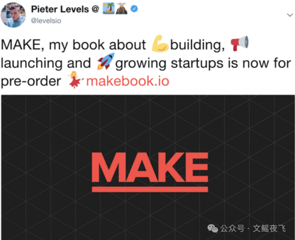
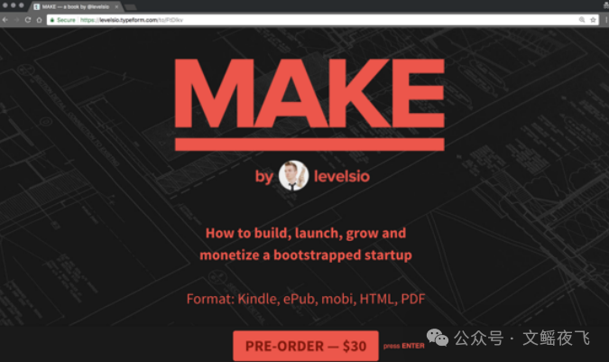
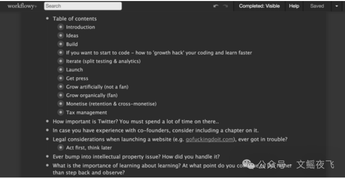
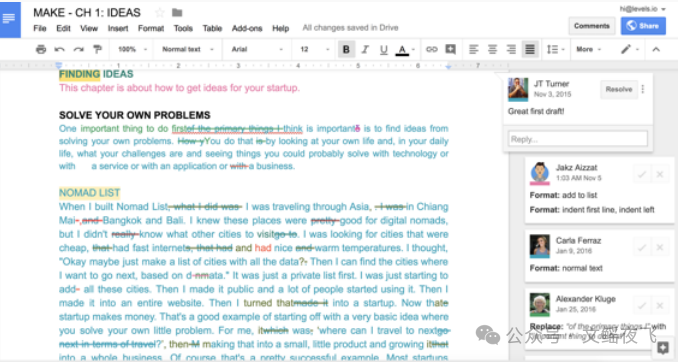
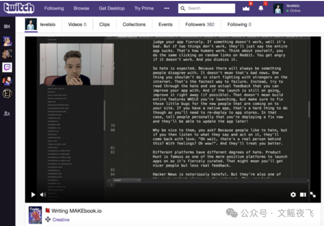
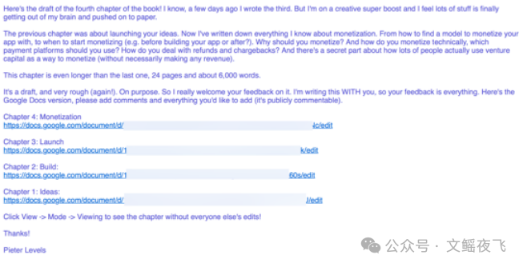

# 一人公司大神Peter Levels《MAKE》（03）：关于这本书

为了避免写出一本充斥着未经证实的理论的书，我决定在元层面（meta level）上做一个尝试：**用书中所描述的理论来创作和销售这本书** 。

如果我能按照书中的方法成功生产并售出这本书，这在某种程度上就能证明这些理论是行之有效的 。所以我就是这么做的 。

  

在动笔写下第一行字之前，我就公开宣布了这本书并开启了预售 ：

当时的登陆页面其实就是一个 Typeform 表单，告诉大家我想写一本书，但书还没写出来，如果想支持我，请预付 14.99 美元 。

  

付款后，人们立即收到的唯一东西是一个空的 **Workflowy** 列表，他们可以在上面写下希望书中涵盖的具体内容 。这让我能够立即获得客户的反馈，知道他们想让我做什么，就像做初创公司一样 。

  

  

成千上万的人预订了这本书（以 14.99 美元的价格迅速获得了超过 50,000 美元的收入），Workflowy 列表里也有了数千项可写的内容 。我定期梳理并重新排序，寻找其中的规律 。我发现可以将所有问题按初创公司的不同阶段划分：**想法、构建、发布、增长和变现** 。每个人所处的阶段不同，需要解决的问题也不同 。

  

然后我开始写第一章。我决定同样采取“**公开构建**”（Building in Public）的方式 。我创建了一个 Google Docs 文档并开始写作 。

  

  

  

在写作过程中，我甚至在 **Twitch** 上直播了我的写作过程 。这对我很有帮助，因为如果你写过书或论文，你就知道写作过程中的“拖延症”是多么可怕 。

  

###   

  

每当我写完一章的草稿，我就会发给所有预购客户 。他们可以作为 Google Docs 的协作者直接在文档里发表评论 。

  

  

只有这本书最后的润色过程（也就是我现在的阶段）是我独自完成的 。但 **90% 的创作过程都是完全公开的** 。

  

这正是我构建初创公司的方式：**尽早发布，与用户一起构建，为用户而构建** 。