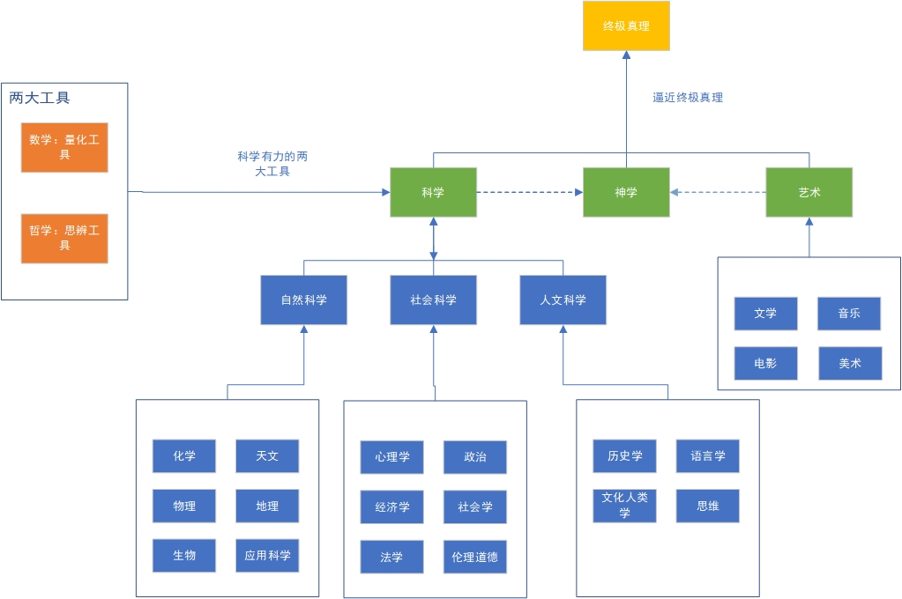

# 什么是通识教育（二）

## 一、通识教育是一种学习的方法论

在什么是通识教育（一）中，讨论了通识教育的定义和框架，有《通识》这本读物的通识教育框架，有钱学森的框架，这些都是对通识教育在做定于与分类，认识一件事情，首先是从这件事情的**定义与分类**开始，基于定义与分类，才会对此事有一个整体的认识，在整体认识的基础上才能找到适合自己的认识和方法。

通识教育就是对学习知识这一过程进行底层认知的方式。每个人从出生开始就要面对各种学习。作为公民，我们都有接受九年义务教育的权利，因此我们早早就开始了学习的旅程。对通识教育进行分类框架的目的在于给知识进行分类，提高学习效率，明确学习的目标。**它本质上是一种学习的方法论**。

让我举一个健身的例子来说明。假设我想要锻炼获得完美的身材，那么如何做好这件事呢？我们需要找到相应的方法。如果我们在没有对整个健身过程有整体认识的情况下盲目开始，就会缺乏明确的目标和计划。我们需要思考一些问题：是去健身房还是在家锻炼？是进行有氧运动还是无氧运动？为什么增肌？为什么减脂？如果在这些问题上一无所知就开始，过程将会非常困难。因此，如果我们要进行健身，就应该首先对健身有一个整体的认识。以下是健身的定义和分类：

**健身的定义**：健身是指通过徒手或利用各种器械，运用专门科学的动作方式和方法进行锻炼，以发达肌肉、增长体力、改善形体和陶冶情操为目的的运动项目

**健身的分类**：徒手健身、器械健身、增肌的本质、减脂本质、有氧运动、无氧运动

先对以上信息做充分的了解，再开始也不迟。

### 那么通识教育有什么好处呢

通识教育帮助我们对知识进行分类，洞察知识的本质。通过对所学知识进行分类，我们能够知道所阅读的书籍和学习的知识属于哪个体系，这个体系与其他体系有什么关联。这样一来，我们的学习目标和效率就能大大提高。学习通识教育的好处在于**激发我们的智慧**。一个人必须将所学的各个领域的知识及其关联加以整合，才能最大程度地发挥人类的智慧潜能。

智慧是什么？**智慧是对于选择和判断某件事情准确性的能力**。学习通识教育使我们不仅局限于一个特定体系处理问题，而是能够从多个维度来思考问题，增加我们对事物的认知，提高我们判断准确性的概率，从而提升我们认识和解决问题的能力。

## 二、我整理的通识教育的分类框架

在知识体系的构建方面，有许多不同的版本，例如钱学森的框架、《通识》一书的框架以及杜威的分类法等。然而，在实践中，每个人都会有自己的理解和认知。下面是我总结的通识教育框架：

**道**：指的是终极真理，宇宙的本质、规则和天道。道是永恒不变的真理，无法用言语或描述来表达。

**一**：指的是相对真理。相对真理是人类能够认识到的真理，科学、神学、艺术、数学、哲学等都具有各自的相对真理。这些真理不是永恒不变的，而是在特定条件下成立的。

**二**：指的是哲学和数学。哲学和数学是两个重要的工具，通过它们可以接近终极真理。数学是一种量化的工具，哲学是一种思辨的工具。

**三**：指的是科学、神学和艺术。科学包括自然科学、社会科学和人文科学，神学涵盖了人类各大宗教的教义，艺术则包括各种艺术创作形式。

**万物**：指的是世间万事万物和各行各业。

以上分类借用了《道德经》中的道生一、一生二、二生三、三生万物的观念。道代表终极真理，一代表相对真理，二代表哲学和数学，三代表科学、神学和艺术，而万物则代表由此衍生出的世间万事万物和各行各业。

《禅与摩托车维修艺术》一书以良质来概括知识体系，将良质等同于道，将三代表宗教、艺术和科学。

>斐德洛说过“良质就是佛陀”，这种断言如果是真的，就能为人类现在分裂的三种经验找到融合的理性基础，这三个方面是宗教、艺术和科学。如果能够证明这三者的中心术语就是良质，而良质只有一种而非许多种，那么这三种分裂的经验就有了互相交流的基础。

    

